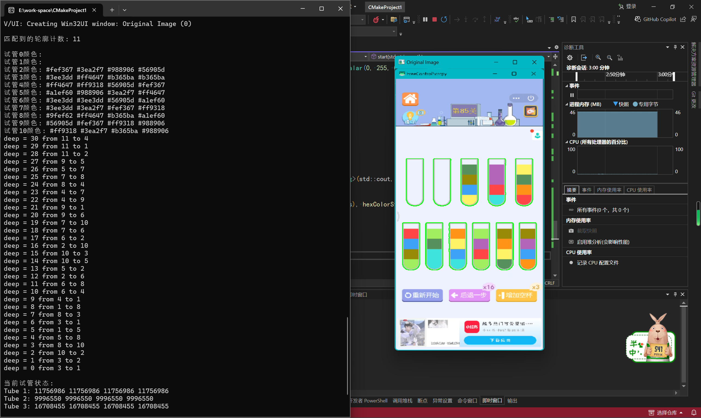
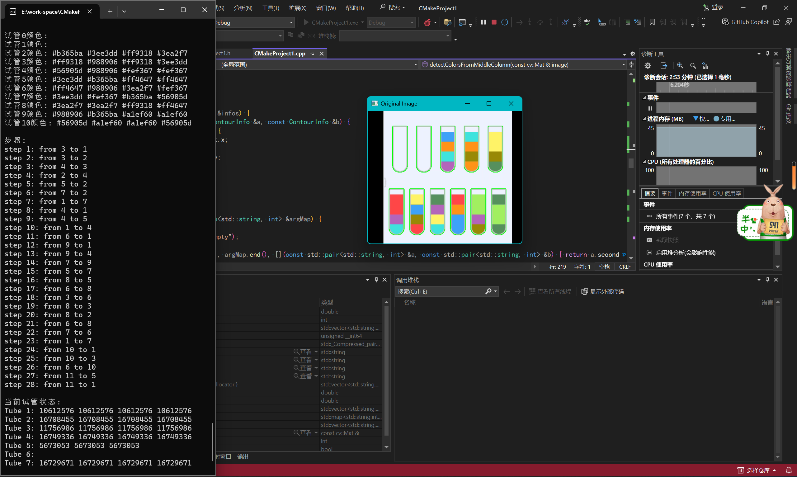
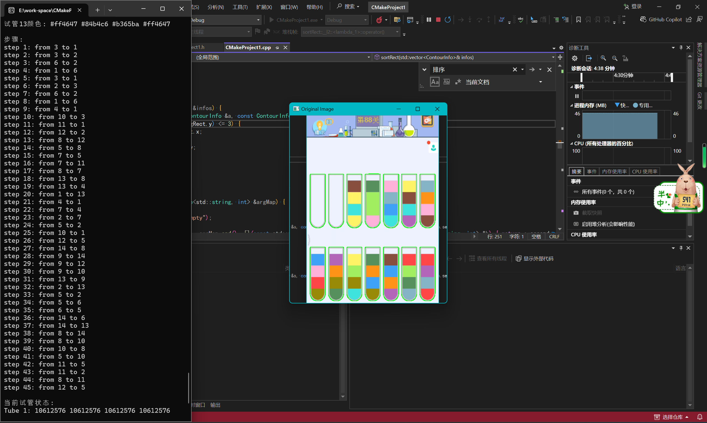

# 水排序谜题求解器

这是一个使用 c++ 和 opencv 基于 dfs 算法的倒水问题求解器

## 说明

这是我现在开始学 c 艹 的练手项目，所以会有很多瑕疵，但是基本能正常运行

### 算法

dfs 算法来源：[水排序谜题\_水排序求解-CSDN 博客](https://blog.csdn.net/nameofcsdn/article/details/117620445)

识别算法：由于原文([Opencv 应用——水排序谜题\_水排序关卡生成-CSDN 博客](https://blog.csdn.net/nameofcsdn/article/details/118256973))对图片大小等因素有要求，所以改动了一下，现在只需要截取试管部分就行。

## 运行

游戏中切换试管为初始试管，截图到 `d:/dm.png` 或者修改代码中的路径，然后运行项目即可

> 我也刚学，如果跑不起来我是无法提供帮助的！

## 效果

